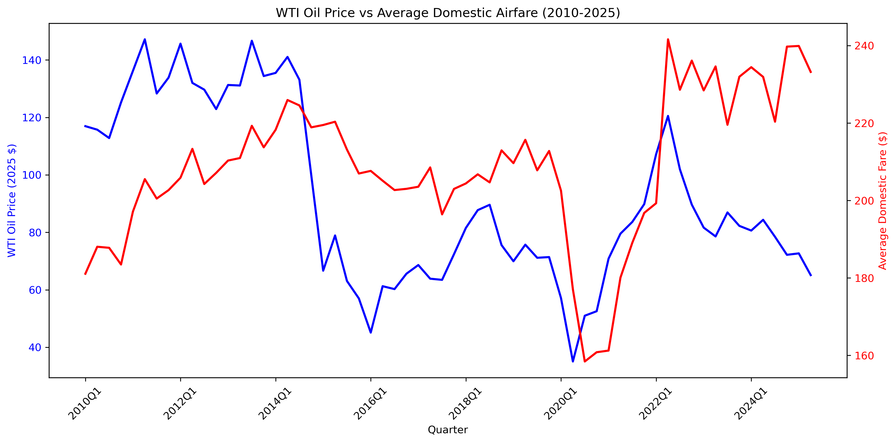
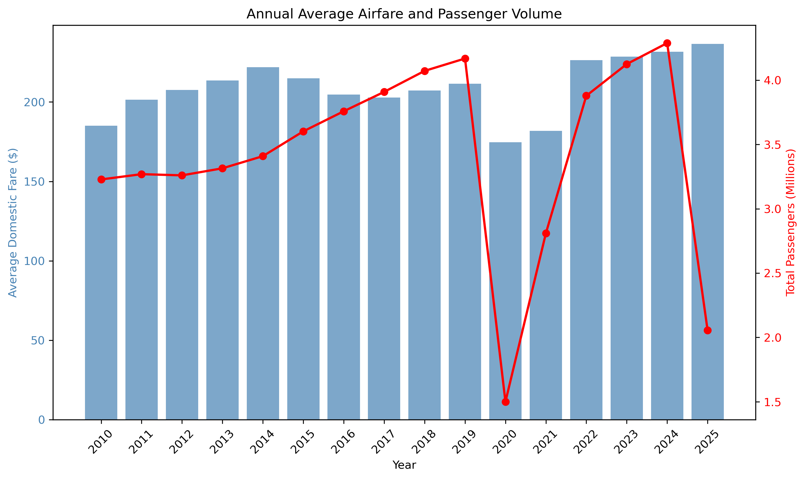
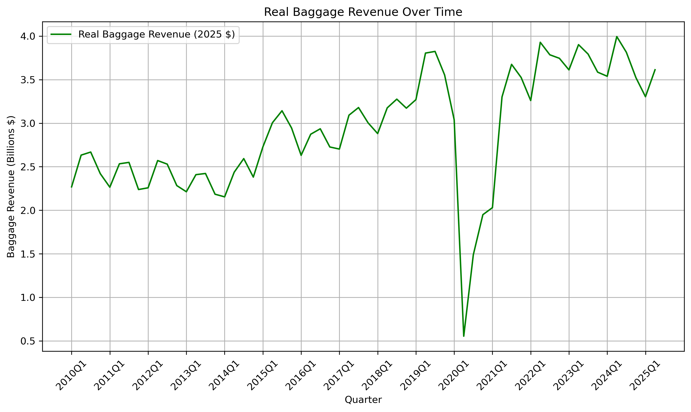
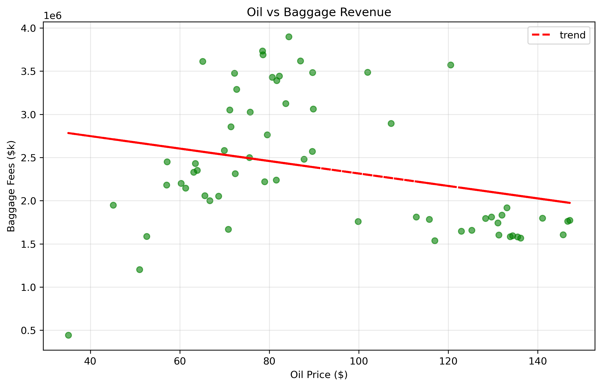
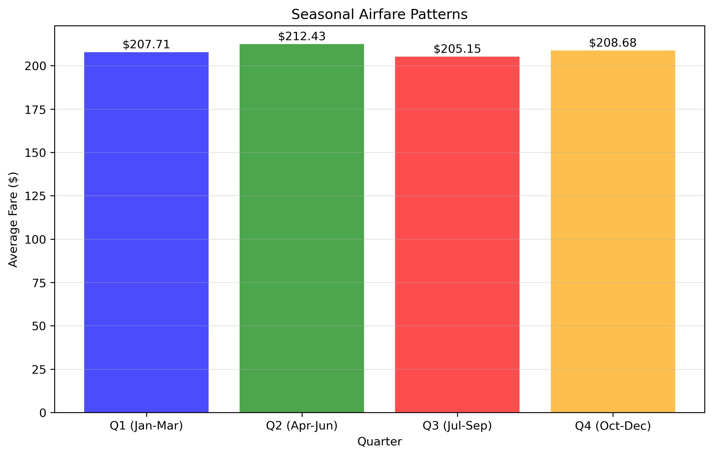

# Airfare, Oil Prices, and Baggage Revenue Analysis (2010-2025)

A data science investigation into what really drives airfare prices in the U.S. domestic aviation market.

**Team:** Jackson O'Connell & Sushanth Chunduri | **Course:** CS 2316 (Fall 2025) | **TA:** Sid

---

## The Big Question

Everyone assumes fuel prices drive airfare costs. Oil goes up, tickets get more expensive. Oil crashes, flights should be cheaper. Right?

Not so fast. After crunching 15 years of data from multiple government sources, we found something surprising: **passenger demand matters way more than oil prices when it comes to what you pay for a ticket.**

This project digs into quarterly data from 2010 to 2025, examining airfares, oil prices, passenger volumes, and baggage fee revenue. The findings challenge some common assumptions about airline economics.

---

## What We Found

### 1. Oil Prices Are a Terrible Predictor of Airfares

We ran a linear regression model using oil prices to predict airfares. The result? An R² score that was actually **negative** — meaning you'd be better off just guessing the average fare every time than trying to use oil prices to predict ticket costs.



Look at 2014-2016 when oil prices crashed by over 60%. Airfares barely budged. Airlines kept prices stable despite massive fuel savings. Why? Competition and passenger demand are what actually set prices.

When we used Random Forest modeling to assess feature importance across multiple variables, oil prices came in dead last at just 8% importance. Meanwhile, passenger demand accounted for 57% of the predictive power.

### 2. Passenger Demand Drives Everything

Simple supply and demand economics win out. When more people want to fly, prices can stay higher. When demand drops (hello, COVID-19), airlines have to cut fares to fill seats.



The 2020 data tells the story clearly. Both passengers and fares plummeted during the pandemic. But here's the interesting part: as passengers came back, airlines were able to push fares higher than before. The market had changed, and demand supported higher prices.

### 3. Baggage Fees Keep Growing (Big Time)

Remember when checked bags were free? Those days are long gone, and the revenue numbers prove it.



Baggage fee revenue has grown **133% in real dollars** from 2010 to 2025. That's after adjusting for inflation. Airlines now pull in $1.5-1.8 billion per quarter from baggage fees alone. 

This isn't about fuel costs — it's a fundamental shift in airline business models. They've moved to an "unbundled" pricing strategy where the base ticket is just the starting point.

### 4. The Oil-Baggage Relationship Is Weird

When we looked at oil prices versus baggage revenue, we found a non-linear relationship. It's not straightforward at all.



The polynomial regression model (degree 2) fits better than a straight line, but even then it only explains about 48% of the variation. The relationship curves — baggage revenue tends to peak around mid-range oil prices and flatten out at extremes.

What's really happening? Baggage fees are growing over time regardless of oil prices. The scatter plot shows a general upward trend, but individual quarters bounce around a lot based on seasonal travel patterns and passenger volumes.

### 5. Seasonality Exists But It's Smaller Than You'd Think

Summer flights (Q3) are the most expensive on average, but the difference between the cheapest and most expensive quarters is only about $10-15 — roughly 3-4% of the average fare.



Why so little variation? National averages smooth out regional differences (Florida winter travel vs Colorado ski season), and dynamic pricing means airlines adjust based on real-time demand rather than following a fixed seasonal calendar. Plus, business travel keeps demand fairly steady year-round.

---

## The Data

We pulled together four different data sources to make this analysis happen:

### Baggage Fees (Excel files from BTS)
Source: [Bureau of Transportation Statistics](https://www.bts.gov/baggage-fees)

Quarterly baggage revenue by airline from 2007-2025. The fun part? Each year was in a different Excel sheet with inconsistent formatting. We wrote a custom header detection algorithm to handle all the variations.

### Consumer Airfares (CSV from BTS)
Source: [BTS Consumer Airfare Report](https://www.transportation.gov/policy/aviation-policy/domestic-airline-consumer-airfare-report)

Domestic airfare prices by city pair, quarter, and carrier. Hundreds of thousands of routes condensed into weighted quarterly averages based on passenger volume.

### CPI Data (Web Scraped from FRED)
Source: [Federal Reserve Economic Data](https://fred.stlouisfed.org/data/CPIAUCSL)

Consumer Price Index data for converting all dollar amounts to 2025 dollars. We scraped this using BeautifulSoup and converted monthly data to quarterly averages.

### Oil Prices (API from EIA)
Source: [U.S. Energy Information Administration](https://api.eia.gov/v2/petroleum/pri/spt/data/)

West Texas Intermediate (WTI) crude oil spot prices. Monthly data aggregated to quarters and inflation-adjusted to 2025 dollars.

---

## Technical Approach

### Data Cleaning

The hardest part was wrangling the baggage fee Excel files. Different header positions, mixed data types (some cells had '-' instead of 0), and inconsistent column names across years. We iterated through each year sheet, detected headers dynamically, extracted quarterly columns, and reshaped everything into a clean long format.

Airfare data had its own issues: comma-separated numbers as strings, dollar signs in monetary values, and missing values scattered throughout. Standard pandas operations cleaned most of it up.

### Statistical Modeling

We threw three different models at the data:

**Linear Regression** — Testing if oil prices predict airfares (they don't)

**Polynomial Regression (Degree 2)** — Finding the curved relationship between oil and baggage fees

**Random Forest Regressor** — Determining which factors matter most (100 trees, 80/20 train/test split)

All monetary values were adjusted to 2025 dollars using CPI data, so we're comparing apples to apples across the 15-year period.

### Libraries Used

```python
pandas, numpy, matplotlib           # Data wrangling and visualization
sklearn                             # Machine learning models
BeautifulSoup, requests             # Web scraping
regex, json                         # Data parsing
```

---

## Key Takeaways

**For Travelers:** Airfare prices are stable despite oil volatility. Baggage fees are here to stay and growing. Book when demand is lower (not just when oil is cheap).

**For Airlines:** Pricing power comes from managing demand, not passing through fuel costs. Ancillary revenue like baggage fees is critical and growing. Fuel hedging strategies seem to be working.

**For Policy Folks:** Competition keeps fares in check more than anything else. Transparency in ancillary fees matters since they're such a big revenue source now. If you want to influence prices, focus on demand-side policies.

---

## The Unexpected Finding

Going into this, we expected a strong connection between oil and airfares. That's what makes sense, right? Fuel is one of airlines' biggest costs.

But the data told a different story. Oil prices swing wildly — sometimes dropping 60% in just two years — while airfares barely move. Airlines have gotten sophisticated at hedging fuel costs, locking in prices well in advance. They've also shifted to a business model where the base fare is competitive but ancillary revenue (baggage, seat selection, priority boarding) provides the profit margin.

The real story is about how the industry has evolved. It's less about cost pass-through and more about sophisticated revenue management and pricing psychology.

---

## Project Stats

- **Time Period:** 2010 Q1 through 2025 Q4 (64 quarters)
- **Total Data Points:** 320+ aggregated quarterly metrics
- **Models Trained:** 3 (Linear, Polynomial, Random Forest)
- **Visualizations:** 8 plots generated
- **Data Sources:** 4 different government datasets
- **Lines of Code:** ~867 (including documentation)

---

## Files in This Repository

**Data Files:**
- `dataset_a_quarterly.csv` — Final merged dataset (all quarters combined)
- `eia_wti_quarterly.csv` — Cleaned oil price data
- `cpi_clean.csv` — Quarterly CPI indices
- `ConsumerAirfares.csv` — Raw airfare data
- `BaggageFees.xlsx` — Raw baggage fee data

**Visualizations:**
- `oil_vs_airfare_timeseries.png` — Dual-axis time series comparing oil and airfare
- `oil_vs_baggage_scatter.png` — Scatter plot with polynomial trendline
- `seasonal_fare_patterns.png` — Quarterly seasonal variation
- `visualization_1_oil_vs_airfare.png` — Publication-quality oil vs airfare plot
- `visualization_2_oil_vs_baggage.png` — Oil vs baggage revenue
- `visualization_3_baggage_revenue_time.png` — Baggage revenue growth over time
- `visualization_4_annual_fare_passengers.png` — Annual comparison of fares and passengers

**Notebooks:**
- `Phase III.ipynb` — Main analysis notebook with all code
- `Final Project Phase II.ipynb` — Earlier phase work
- Various cleaning notebooks (`BaggageCleaner.ipynb`, `CleanAirfares.ipynb`)

**Documentation:**
- `PhaseIIIExplanation.md` — Detailed technical documentation
- `CS2316_OnePager.pdf` — Project summary
- `CS2316 Phase III Final Slides.pptx` — Presentation deck

---

## Methodology Notes

All analysis used an 80/20 train/test split with `random_state=42` for reproducibility. Visualizations were generated at 300 DPI for publication quality.

Airfares were calculated as weighted averages by passenger volume — so a route with 1 million passengers has 10x the influence of a route with 100,000 passengers. This gives a more accurate picture of what the "average American traveler" pays.

Oil prices and baggage revenues were adjusted for inflation using CPI data. Every dollar amount in this analysis is in 2025 dollars, so temporal comparisons are valid.

---

## Want to Reproduce This?

1. Clone the repository
2. Make sure you have Python 3.x with pandas, numpy, matplotlib, sklearn, BeautifulSoup, and requests
3. Open `Phase III.ipynb` in Jupyter Notebook
4. Run all cells

The notebook will re-scrape CPI data, fetch oil prices from the EIA API (using the included API key), process the Excel and CSV files, run all models, and regenerate all visualizations.

---

## References

Data sources are all public government databases:
- Bureau of Transportation Statistics for airfare and baggage data
- Federal Reserve Economic Data (FRED) for CPI
- U.S. Energy Information Administration for oil prices

All data accessed between November 2024 and January 2025.

---

*This project was completed as part of CS 2316 (Data Input/Manipulation) at Georgia Tech, Fall 2025. The analysis demonstrates web scraping, API integration, complex data cleaning, statistical modeling, and data visualization techniques.*
